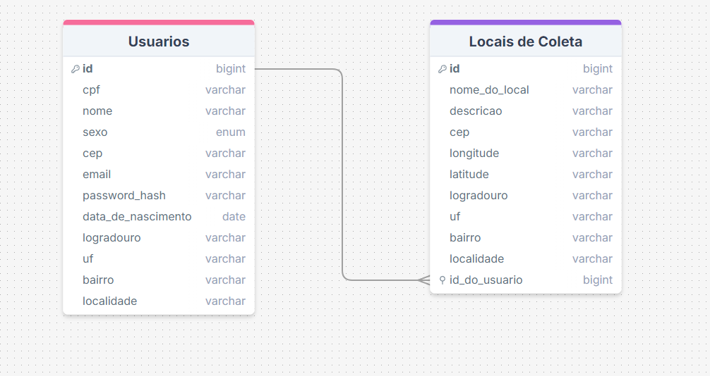

# Recicla365

## Descrição do Problema

**Recicla365** é uma aplicação desenvolvida para solucionar a dificuldade de encontrar locais de coleta de materias reciclaveis, ele resolve esse problema através dessa API, que pode cadastrar usuarios em um banco de dados, esse usuarios se fizerem uma autenticação(login), podem cadastrar locais de coleta no mesmo banco de dados, podem acessar os locais que eles cadastraram, atualizar esses locais, deletar eles, e ainda gerar um link do google maps que leva para esse local ! E com essa base de dados de locais de coleta da api será desenvolvido um site onde pode se encontrar facilmente locais de coleta de materiais reciclaveis perto de você !

## Técnicas e Tecnologias Utilizadas

- **Node.js**: Ambiente de execução para JavaScript do lado do servidor.
- **Express**: Framework para construção da API RESTful.
- **Sequelize**: ORM (Object-Relational Mapper) para interagir com o banco de dados SQL.
- **JWT (JSON Web Tokens)**: Para autenticação e gerenciamento de sessões de usuários.
- **PostgreSQL**: Sistema de banco de dados relacional.
- **bcrypt**: Biblioteca para criptografia de senhas.

### Diagrama de Arquitetura



### Migrações Utilizadas

As migrações são os arquivos do sequelize responsaveis pela criação e alteração das estruturas das suas tabelas do projeto, as migrações usadas nesse projeto foram duas:

1. **Cria-Tabela-Usuarios**:
Essa migração tem o nome bem descritivo, ela apenas cria a tabela de usuarios que possui as colunas que mostra no diagrama.

2. **Cria-Tabela-Locais-de-Coleta**:
Essa migração igual a outra possui um nome bem descritivo, ela apenas cria a tabela dos locais de coleta, essa tabela que possui as colunas mostradas no diagrama.

## Como Executar

1. **Clone o repositório**:
```bash
git clone https://github.com/Victor3294/M2-Projeto-Avaliativo.git
```
2. **Configure as variáveis de ambiente criando um arquivo .env baseado no .env.example**.

3. **Instale as dependências**:

```bash
npm install
```

4. **Execute as migrações do banco de dados**:

```bash
npx sequelize-cli db:migrate
```
5. **Inicie a api**:

```bash
npm run start:prod
```

6. **Usando a API**:

Use o link onde a api foi hospedada, em algum aplicativo tipo o postman, ou pode ser testada com o 'linkgeradodasuaapi/docs' através do swagger

## Melhorias Futuras

- **Suporte a Múltiplos Bancos de Dados**: Adicionar suporte para outros sistemas de banco de dados além do PostgreSQL.
- **Sistema de Permissões e Roles**: Implementar um sistema de controle de acesso baseado em roles para diferentes níveis de permissão.
- **Testes Automatizados**: Implementar testes unitários e de integração para garantir a qualidade do código e a estabilidade da API.
- **Ampliação do banco de dados**: Implementar uma terceira tabela e fazer o relacionamento entre usuarios e locais de coleta ser de NxN, com o objetivo de melhorar a performace quando tiver mais usuarios e locais cadastrados
- **Aplicação da API no front end**: Aplicar as funcionalidades da api em um site para o recicla 365

## Contribuição

Contribuições são bem-vindas! Sinta-se à vontade para enviar pull requests, abrir issues ou sugerir melhorias. Para contribuir, siga estes passos:

1. Faça um fork do repositório.
2. Crie uma nova branch para suas modificações.
3. Faça suas alterações e commit.
4. Envie um pull request com uma descrição clara das alterações.

## Contato

Para mais informações, entre em contato com [Victor Blum](mailto:vblum26@gmail.com).
